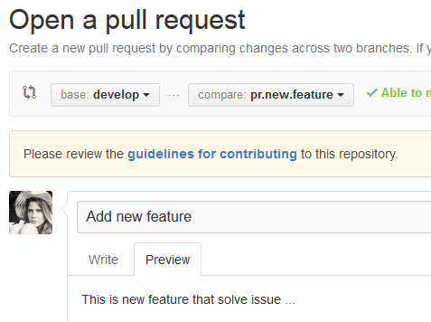

Git
---

Preparing pull request
======================

Never use tabs
~~~~~~~~~~~~~~

Don't use tabs in code. How they are interpreted depends on the IDE/environment
so everybody will see different picture. Mixed with the spaces makes code
completely unreadable.

Inserting spaces on pressing TAB
++++++++++++++++++++++++++++++++

* In ``Visual Studio`` use `Insert spaces`_
* Use `expandtab`_ in `gVim`_ (see `vimrc example`__)
* In ``Xcode`` set `Prefer indent using`_ to ``Spaces``
* Set ``indent-tabs-mode`` to ``nil`` in your `.emacs file`_

.. _Insert spaces: https://blogs.msdn.microsoft.com/zainnab/2010/09/08/insert-spaces-vs-keep-tabs
.. _expandtab: http://vim.wikia.com/wiki/Converting_tabs_to_spaces
.. __: https://github.com/ruslo/configs/blob/42d6d3d2b2aabf0e8ff0c0cbcd073667ce6a8605/vim/vimrc#L24
.. _Prefer indent using: https://developer.apple.com/library/ios/recipes/xcode_help-source_editor_preferences/articles/setting_source_editing_and_indenting_options.html
.. _.emacs file: http://www.emacswiki.org/emacs/NoTabs

Highlight tabs in text editor
+++++++++++++++++++++++++++++

* In `gVim`_ you can use ``highlight`` and ``match`` commands, see `vimrc example`__

.. __: https://github.com/ruslo/configs/blob/42d6d3d2b2aabf0e8ff0c0cbcd073667ce6a8605/vim/vimrc#L118

Removing tabs from file
+++++++++++++++++++++++

* Use ``sed -i 's,\t,  ,g' main.cpp`` on Linux
* Use ``gsed -i 's,\t,  ,g' main.cpp`` on OSX
* In `gVim`_ you can execute ``:%s,\t,  ,g`` command

.. _gVim: http://www.vim.org/

.. seealso::

  `Google style guide - Spaces vs Tabs <https://google.github.io/styleguide/cppguide.html#Spaces_vs._Tabs>`_

Remove trailing whitespaces
~~~~~~~~~~~~~~~~~~~~~~~~~~~

Trailing whitespaces doesn't change code execution flow, may be not visible
to user but add additional mess with the diffs.

* Use ``sed`` (``gsed`` on OSX) to `remove trailing whitespaces`_
* In `gVim`_ you can execute ``:%s, \+$,  ,g`` command

.. seealso:: `Google style guide - Horizontal Whitespace <https://google.github.io/styleguide/cppguide.html#Horizontal_Whitespace>`_

.. _remove trailing whitespaces: http://stackoverflow.com/a/4438318/2288008

Check there is a new line at end of file
~~~~~~~~~~~~~~~~~~~~~~~~~~~~~~~~~~~~~~~~

You can see this warning while creating github pull request:

.. image:: /images/github-diff-no-newline-warning.png
  :align: center

Set your copyrights
~~~~~~~~~~~~~~~~~~~

Usually there is a copyright note at the top of the source file.
Please add your name there. Update year if necessary.

Keep git commit's summary short
~~~~~~~~~~~~~~~~~~~~~~~~~~~~~~~

Long summary makes output of ``git branch -vv`` looks bad:

.. image:: /images/git-branch-verbose-output-of-long-summary.png
  :align: center

Same with the ``git log --pretty=oneline`` output.

On github summary can be used as a topic of the pull request. So it will looks
ugly too:

.. image:: /images/github-pull-request-long-summary.png
  :align: center

.. seealso:: `Linux recommendation <http://git.kernel.org/cgit/linux/kernel/git/torvalds/linux.git/tree/Documentation/SubmittingPatches?id=HEAD#n655>`_

Margin 80 characters
~~~~~~~~~~~~~~~~~~~~

Keep each line of the code so line length is 80 characters maximum.

* For ``gVim`` you can highlight margin using ``join`` command, see `vimrc example`__
* This rule can be ignored for hyperlinks

.. seealso:: `Google style guide - Line Length <https://google.github.io/styleguide/cppguide.html#Line_Length>`_

.. __: https://github.com/ruslo/configs/blob/42d6d3d2b2aabf0e8ff0c0cbcd073667ce6a8605/vim/vimrc#L73

Keep each commit as trivial as possible
~~~~~~~~~~~~~~~~~~~~~~~~~~~~~~~~~~~~~~~

Keep your commits as trivial as possible, do not mix nonrelated changes in one commit.
For example:

* Do not mix renaming of variable with changes in logic - make two commits:

 1. rename variable
 2. apply other changes

* Do not rename file and do change of it's internals - make two commits:

 1. rename file
 2. change internals

* Quite the same with big blocks of code. If block moves with a small change make two commits:

 1. move big block only
 2. change code in block

In short keep in mind that cosmetic/trivial changes is quite easy to review (unlike logic) but they can add additional mess.

Submitting pull request
=======================

Pick target branch
~~~~~~~~~~~~~~~~~~

Usually default branch is called ``master``. If there is one more branch
called ``develop`` send a patch as a pull request against it.
After successfull testing this branch will be merged to ``master``.

Read CONTRIBUTING
~~~~~~~~~~~~~~~~~~

If there if ``CONTRIBUTING`` file in repository you will see
``guidelines for contributing`` link. Please read it before submit :)

Updating pull request
=====================

Notify
~~~~~~

Please note that when you're updating pull request
(by doing ``git push origin <branch-linked-to-pr>``)
**no notification will be send** to anybody. So when you're done just add
the "ping" note, like ``Updated!``.

.. seealso::

  * `GitHub collaborating <https://help.github.com/categories/collaborating/>`_
  * `Git: contributing to a project <http://git-scm.com/book/en/v1/Distributed-Git-Contributing-to-a-Project>`_
